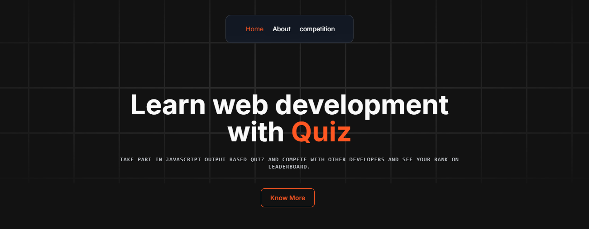

# JavaScript Quiz Website

Welcome to the JavaScript Quiz Website! This is a Next.js application that allows users to participate in JavaScript output-based quizzes and view their real-time ranks on the leaderboard.

## Project



## Features

- **JavaScript Quizzes**: Play quizzes with various JavaScript output-based questions.
- **Leaderboard**: View real-time rankings of participants.
- **Responsive Design**: Optimized for various devices and screen sizes.
- **Real-Time Updates**: See your rank and others' performance in real-time.

## Prerequisites

Before running this application, ensure you have the following installed:

- [Node.js](https://nodejs.org/) (v14 or later)
- [npm](https://www.npmjs.com/)

## Installation

1. **Clone the Repository**

   ```bash
   git clone https://github.com/cykoravish/web-dev-quiz-next.git
   cd webdevquiz
   npm install
   ```

## Configuration

### Environment Variables

Create a `.env.local` file in the root directory of the project and add your environment variables. Here is a sample configuration:

```env
MONGO_URI=
JWT_TOKEN_SECRET=
NODE_ENV=
```

### Database Setup

1. **Set Up MongoDB**

   Ensure your MongoDB database is set up and accessible. You can use a service like [MongoDB Atlas](https://www.mongodb.com/cloud/atlas) or host it yourself.

2. **Update `.env.local`**

   Update the `MONGODB_URI` in the `.env.local` file with your MongoDB connection string.

3. **Create Collections**

   If you are using MongoDB Atlas or a similar managed service, you might need to create collections or import initial data into your database.

4. **Access Database**

   Ensure that your application has the necessary permissions to access and modify the MongoDB database. Verify that the network access settings are correctly configured (e.g., IP whitelist).

## Contributing

If you'd like to contribute to this project, please follow these steps:

1. **Fork the repository**

   Click the "Fork" button at the top right of the repository page on GitHub to create your own copy of the repository.

2. **Create a new branch**

   ```bash
   git checkout -b feature/YourFeature
   git add .
   git commit -m 'Add new feature or fix'
   git push origin feature/YourFeature
   ```

## Contact

For any questions, feedback, or inquiries, please feel free to reach out through the following channels:

- **Email:** [ravishbisht86@gmail.com](mailto:ravishbisht86@gmail.com)
- **Instagram:** [Ravish](https://instagram.com/web________developer)

We value your feedback and will do our best to respond promptly!

## License

This project is licensed under the MIT License.
